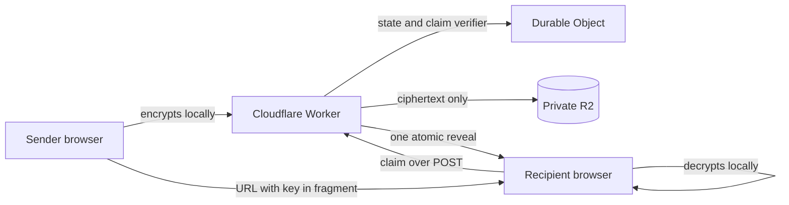

# NoSuchSecret

**Share it once. Then it never existed.**

[](https://github.com/hroost/no-such-secret/actions/workflows/ci.yml)
[](LICENSE)

NoSuchSecret is a small, MIT-licensed Cloudflare application for one-time sharing of text and files (up to 10 MiB). It is meant to be deployed independently by one organization or individual; it is not a hosted service and sends no analytics or telemetry to the project.

## Security model

The browser generates an AES-256-GCM key and a separate 256-bit claim capability. It encrypts the content before upload and keeps the AES key only in the URL fragment, which browsers do not send to the server. Cloudflare stores only ciphertext, a nonce, and a SHA-256 verifier for the claim capability.

Opening a link and checking its status are safe. An explicit **Reveal secret** button sends a `POST`; the Durable Object atomically changes `FILLED` to `CONSUMED` before reading ciphertext. A lost reveal response therefore means the secret is unrecoverable—this is intentional strict one-time behavior.

This protects stored secrets from normal service operation. It cannot protect a user from a malicious or compromised JavaScript deployment at the same origin, because that code can observe plaintext and fragment keys in the browser. Review and control your deployment pipeline accordingly.

## Flows

| Action | Sender | Recipient | URL |
| --- | --- | --- | --- |
| Share internally | Access user | Access user | `/internal/share/:id#v1…` |
| Share externally | Access user | Capability holder | `/public/share/:id#v1…` |
| Request internally | Access user | Access user | `/internal/request/:id` then `/internal/request/:id#v1…` |
| Request externally | Capability holder | Access user | `/public/request/:id` then `/internal/request/:id#v1…` |

`/internal/*` and `/api/internal/*` require Cloudflare Access both at the edge and in the Worker. `/public/*` is unauthenticated but protected by a high-entropy object ID and, for reveal, a separate claim capability.

## Architecture

- React + TypeScript SPA built with Vite and the Cloudflare Vite plugin
- Hono Worker API
- One Durable Object per public ID for serialized state transitions
- Private R2 bucket containing opaque encrypted payloads only
- Cloudflare Access JWT validation on internal Worker routes

No D1, KV, dashboard, history, local secret persistence, service worker, or telemetry is included.



The Worker sees the claim during reveal, but never receives the fragment or AES key. See the [threat model](docs/THREAT_MODEL.md) for trust boundaries, guarantees, and non-goals.

## Local development

Prerequisites: Node 22+, pnpm 11, and a Cloudflare account for a full integration deployment.

```bash
pnpm install
cp .dev.vars.example .dev.vars
pnpm run dev
pnpm run check
pnpm test
```

`.dev.vars` enables `INTERNAL_AUTH_BYPASS=true` for local development only. Never deploy that variable. Local Wrangler development supplies local Durable Objects and R2; `.env.example` documents safe deployment variable names.

## Deployment

1. Create a private R2 bucket: `pnpm exec wrangler r2 bucket create no-such-secret-payloads`.
2. Update the `r2_buckets` bucket name in `wrangler.jsonc` if needed; keep the bucket private.
3. Create a Cloudflare Access application for `share.example.com` (or your own hostname). Configure Access policies for `/`, `/share*`, `/request*`, `/internal/*`, and `/api/internal/*`; explicitly exclude `/public/*` and `/api/public/*`.
4. Set the Worker secrets/variables from the Access application:

   ```bash
   pnpm exec wrangler secret put CF_ACCESS_AUD
   pnpm exec wrangler secret put CF_ACCESS_TEAM_DOMAIN
   ```

   `CF_ACCESS_TEAM_DOMAIN` is the full `https://your-team.cloudflareaccess.com` issuer. The Worker validates signature, issuer, audience, and expiry against its rotating JWKS.
5. Replace the example `ratelimits[0].namespace_id` (`1001`) with an unused positive integer in your Cloudflare account. The binding limits public operations by ID and source IP, and authenticated creation by identity.
6. Set `PUBLIC_BASE_URL` and optional `APP_NAME`, `ORGANIZATION_NAME`, `SUPPORT_URL`, `ACCENT_COLOR`, `LOGO_URL`, and `FAVICON_URL`. Logo and favicon values must be same-origin absolute paths such as `/brand/logo.svg`. Do not put credentials, account IDs, or real domains in this repository.
7. Build and deploy: `pnpm run deploy`.

Use separate Worker, Durable Object, R2, Access application, rate-limit namespace, hostname, and secrets for every deployment environment. A personal deployment uses an Access policy allowing only its owner; the source and public-link behavior remain the same.

The Durable Object `v1` migration establishes SQLite-backed object state. Treat future migrations as forward-only: run `pnpm run deploy:dry-run` in an isolated environment before production and never use a class-deletion migration for a live deployment.

### Post-deploy verification

Use disposable test values only; never paste a real credential into an unverified deployment.

- Confirm `/`, `/internal/*`, and `/api/internal/*` reject a signed-out browser, while `/public/*` remains reachable without Access.
- Create one internal and one external share. Reload each recipient page before revealing to confirm that `GET` and status checks do not consume it.
- Reveal each share once and confirm the next reveal returns unavailable. Repeat the same checks for internal and external requests.
- Submit twice to one request and confirm only the first submission succeeds.
- Inspect responses for `Cache-Control: no-store`, a restrictive CSP, `Referrer-Policy: no-referrer`, and `X-Robots-Tag: noindex`.
- Confirm the R2 bucket has no public endpoint, logs contain no bodies, fragment keys, claims, or plaintext, and expired/consumed objects are removed.

The [operations runbook](docs/OPERATIONS.md) covers monitoring, incidents, rollback constraints, and teardown.

## Operational notes

- Payloads are limited to 10 MiB plaintext. The R2 lifecycle policy should be set longer than seven days as defense in depth; the application alarm deletes expired objects.
- Cloudflare edge logs can include route IDs. Restrict their retention/access and do not enable request-body capture.
- Use a strict CSP and the provided no-store/no-referrer/noindex headers. Do not add analytics, error trackers, third-party scripts, or a service worker to secret pages.
- Key rotation only affects Cloudflare Access JWT verification keys. Content keys are per-secret, browser-generated, and unavailable after a link is lost or consumed.

## Development and testing

`pnpm run check`, `pnpm run lint`, and `pnpm test` exercise strict typing, linting, crypto round trips/tamper detection, fragment rejection, lifecycle transitions, authentication boundaries, real Worker routing, Durable Object concurrency, and R2 cleanup. The integration tests run locally in Cloudflare's Workers runtime; no account or production data is used.

Before a release, also complete the post-deploy checklist in an isolated environment and manually test the supported browsers. CI runs type checking, linting, all tests, a production build, a Wrangler dry run, a production dependency audit, dependency review on pull requests, and secret scanning.

Security reports belong in [GitHub's private vulnerability reporting channel](https://github.com/hroost/no-such-secret/security/advisories/new), not a public issue. See [SECURITY.md](SECURITY.md).

## License

[MIT](LICENSE).

## Development disclosure

AI-assisted tools were used during development of this project, including for code generation and review. Changes were reviewed and tested by the maintainer. If your contribution or adoption policy excludes AI-assisted software, please take this into account.
